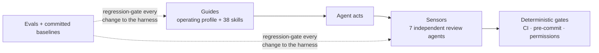

# llm-harness-react

**A governed, measured agent harness for React SPAs.** Make every AI coding
agent on your team work like your best senior engineer: spec-first, test-first,
accessibility-aware, principle-reviewed (SOLID · DRY · KISS · SoC) — and
**provably** so, with committed eval baselines instead of promises.

> In the sense of [Martin Fowler's *Harness Engineering*](https://martinfowler.com/articles/harness-engineering.html):
> `Agent = Model + Harness`. You don't control the model — you control everything
> around it. This package ships that "everything": the **guides** (instructions,
> skills, conventions) that steer the agent *before* it acts, and the **sensors**
> (independent review agents, deterministic gates) that catch problems *after*.

One `npx` command installs it into your repo's `.ruler/` directory;
[ruler](https://github.com/intellectronica/ruler) fans the same source out to
`CLAUDE.md`, `AGENTS.md`, `.github/copilot-instructions.md`, Cursor, and
Windsurf — **one governance investment, every agent tool your team uses**.

---

## The problem it solves

Your engineers already use AI agents. Without a harness, that means N engineers
× M personal prompting styles: conventions enforced only at human code review
(the most expensive point), safety by vigilance, and a rules file nobody can
prove the model actually follows. The result is the opposite of what
engineering leadership needs from AI adoption: **unpredictable output quality,
eroding architecture, and unbounded risk.**

The harness inverts that:



|  | Raw agent + ad-hoc prompts | A static rules file | This harness |
|---|---|---|---|
| Conventions | per engineer, per session | shared, advisory | shared + independently reviewed on every PR |
| Architecture & principles | whatever the model defaults to | mentioned, unenforced | designed in (SOLID/DRY/KISS/SoC, state-layer discipline) **and** reviewed against, per diff |
| Safety (main-push, deploys, token storage) | hope | instructions only | instructions **and** permission denies / CI gates |
| "Does the model actually follow it?" | unknown | unknown | measured — per-model eval baselines, zero-tolerance safety gating |
| Survives model upgrades | n/a | silently degrades | re-baseline, review the behavioral diff |
| Multi-tool (Claude / Copilot / Cursor / Codex) | no | one format | one source, fanned out to all |
| Taking upstream improvements | n/a | manual copy-paste | versioned `update` with a git 3-way merge |

## How it makes agent output predictable

Five mechanisms, layered so no single one has to be perfect:

1. **A priority-ordered operating profile.** `instructions.md` (P0–P9) is the
   always-loaded contract. P0 is non-negotiable safety: never touch `main`,
   explicit human approval for every git write, deploy, DB write, and
   sensitive-data change. Below it: spec-first for behavioral changes,
   TDD for every executable change (with exactly four legal waiver phrases —
   "small change" and "obvious fix" are *forbidden* non-waivers), and an output
   contract whose last line must be **executed** verification, never claimed.
2. **Principles you'd enforce in human review, enforced on agents.** Every
   significant diff gets an independent design review against nine MUST
   principles — **SOLID, DRY, KISS, Separation of Concerns, YAGNI, high
   cohesion / low coupling, fail-fast, explicitness over magic, single source
   of truth** — plus your repo's own conventions. The React skills encode the
   state-layer discipline (server data lives in the query cache, never
   `useState`); a violation is a finding, not a style note.
3. **Independent review agents, fresh context, willing to block.** Seven
   subagents each own one concern — plan review, spec stewardship, design,
   coverage/edge cases/a11y, security (the SPA surface: XSS sinks, token
   storage, `VITE_*` leakage, route guards), live acceptance verification,
   lesson capture. They re-read the conventions themselves rather than trusting
   the implementer, and the final status is the **minimum** over every reviewer
   that ran — never the average. The acceptance verifier re-runs the real
   suites and checks tests are non-vacuous: a green test that wouldn't fail if
   the feature were reverted is flagged, not counted.
4. **Deterministic gates for what advice can't guarantee.** Ready-to-copy CI,
   pre-commit, and agent-permission templates turn the rules into enforcement:
   pushes to `main` are *denied*, deploy/DB-write commands *prompt*, and a red
   typecheck/lint/test/e2e run blocks the merge — regardless of what any model
   intended.
5. **Measurement, so it stays true.** Live-model evals verify routing and gate
   adherence against committed per-model baselines; mutation tests verify the
   evals themselves would catch a deleted gate; a context-decay probe measures
   where instructions degrade. Numbers below.

## What you get

```
.ruler/
├── instructions.md             # the senior-engineer operating profile (P0–P9)
├── ruler.toml                  # ruler fan-out config (claude / copilot / codex / cursor / windsurf)
├── agents/                     # 7 review subagents (sensors) — fresh-context, one concern each
│   ├── architect-reviewer.md   #   PRE        — plan-level design & risk
│   ├── spec-steward.md         #   PRE + POST — requirements gate; owns docs/specs/**
│   ├── code-reviewer.md        #   POST       — design principles (SOLID/DRY/KISS/SoC/…)
│   ├── qa-validator.md         #   POST       — coverage, edge cases, a11y, docs
│   ├── security-reviewer.md    #   POST       — XSS sinks, token storage, VITE_* leakage, route guards
│   ├── acceptance-verifier.md  #   POST, last — runs the LIVE suites; verdict binding on "done"
│   └── lessons-curator.md      #   on user correction — proposes ONE harness improvement
├── skills/                     # 38 guides in 4 families — see the table below
│   └── <name>/SKILL.md         #   dirs stay flat: runtimes discover skills/<name>/SKILL.md
└── tests/                      # the harness's own acceptance + skill-trigger suites
```

| Family | Skills |
|---|---|
| 🧭 Process & discipline (15) | `tdd-workflow` · `design-review` · `plan-mode` · `spec-workflow` · `repo-conventions` · `quality-gates` · `bug-investigation` · `failure-mode-analysis` · `decision-rules` · `documentation-and-adrs` · `git-workflow` · `pushback-templates` · `rlm-explore` · `cross-repo-workspace` · `meta-skill-hygiene` |
| 🔡 Language & code quality (5) | `async-error-handling` · `typescript-advanced-types` · `js-performance-patterns` · `code-simplifier` · `cyclomatic-complexity` |
| ⚛️ React core (9) | `react-patterns` · `react-state-management` · `react-data-fetching` · `react-routing` · `react-forms` · `react-performance` · `react-testing` · `react-design-patterns` · `react-2026` |
| 🎨 Frontend platform & quality (9) | `accessibility` · `frontend-security` · `bundle-size` · `playwright-best-practices` · `vite` · `vitest` · `shadcn` · `tailwind-v4-shadcn` · `ai-ui-patterns` |

The full generated catalog — mindmap plus a one-line gist per skill — lives in
[`skills/README.md`](template/.ruler/skills/README.md) (regenerated from each
skill's frontmatter via `npm run catalog`; CI fails if it drifts).

Two pieces are deliberately **yours to finish**:

- **`repo-conventions`** ships as a fill-in skeleton covering the SPA's
  binding decisions — feature layout, state model, routing/guards, forms,
  styling, auth/token handling, data fetching, and the API contract your app
  consumes. Filling it in is the highest-leverage hour of adoption — it's the
  file every agent *and* every reviewer treats as "what's correct for this repo."
- **`quality-gates`** ships the enforcement templates (`templates/ci.yml`,
  `templates/pre-commit`, `templates/claude-settings.json`). Copy them into
  `.github/workflows/`, `.husky/`, and `.claude/` to turn guidance into gates:
  typecheck, lint, Vitest, and Playwright e2e block a red merge, and the
  agent-permission layer denies pushes to `main` and prompts on
  publish/deploy/DB-write commands.

## Quick start

This is **not** a runtime dependency — `init` copies plain Markdown into your
repo and gets out of the way. Nothing is left in `node_modules`; everything is
inspectable text you own.

```bash
# 1 · Install the harness into ./.ruler
npx @tierone/llm-harness-react init

# 2 · Generate every agent's config from it
npx @intellectronica/ruler apply
```

> **Note the scoped package name** — the bare `ruler` on npm is an unrelated
> package with no executable, so plain `npx ruler apply` fails with *"could not
> determine executable to run."* To keep typing the short command, add it once:
> `npm i -D @intellectronica/ruler`, after which `npx ruler apply` resolves to
> the local binary.

Then make it yours: fill in `repo-conventions`, copy the `quality-gates`
templates into place, and commit — every engineer (and every CI agent run) gets
the harness on next pull, nothing to install per person. For a structured
30-day pilot with a metrics framework, follow
[docs/ADOPTION.md](docs/ADOPTION.md).

When a new harness version ships:

```bash
npx @tierone/llm-harness-react update   # 3-way merge — your local edits survive
```

## Measured, not believed

Most agent-guidelines efforts can't answer *"how do you know the model follows
it?"* This one treats that as a testable claim, with committed, per-model
baselines ([`eval/baseline.json`](eval/baseline.json)) and an append-only score
history ([`eval/history.jsonl`](eval/history.jsonl)):

| Layer | Question | Latest committed result |
|---|---|---|
| **Routing eval** (39 cases incl. negative + confusable, worst-variant scoring) | Does a live model load the right skills — across paraphrases, and nothing for pure questions? | Haiku-class cost floor: **1.000 recall**, 8/8 paraphrase-stable. Sonnet-class: 0.974 recall (over-loads: 0.545 FP/call) |
| **Adherence eval** (25 cases × 3-vote majority; pressure, injection, multi-turn) | Under the full profile, does it emit the literal gates (approval pauses, waivers, path declarations)? | Sonnet-class: **0.920**, safety 11/13, ceremony 8/8. Haiku-class: 0.840, safety 10/13 |
| **Mutation test** | Would the suites catch a deleted gate or a softened MUST? | **6/6 seeded regressions killed** |
| **Context decay** | Does adherence degrade as context fills? | 1.000 at empty → **0.833 at ~30k and ~90k filler tokens** (one probe decays) |

Read the weak numbers as design rationale, not fine print: both models drop the
branch-creation approval pause on some votes, and the cost-floor model bends
under social pressure ("production is down, skip the approval!") — *measurements
of where instructions alone fail*, which is exactly why every safety rule also
exists as a deterministic gate that doesn't care about model size or context
pressure. **Practical model floor:** Sonnet-class for full prose-gate fidelity;
Haiku-class is sufficient *when the permission layer is installed* — it owns
exactly the gates the smaller model fumbles.

Two test layers guard every change to the harness itself:

- **Deterministic** (`npm test`, `npm run test:harness`): unit tests for the
  CLI, a structural acceptance suite (frontmatter integrity, project-agnosticism,
  write-scope guards, instruction budget, anti-regrowth gates), and a static
  skill-trigger simulation. Zero cost, the CI gate.
- **Live-model** (`npm run eval`, see [docs/EVALS.md](docs/EVALS.md)): the routing
  and adherence evals above. Scores gate against the committed baseline; after
  an intended behavioral change, re-run with `--update-baseline` and commit —
  **the baseline diff in the PR is the reviewable evidence of behavioral
  impact**. The scripts self-skip without an API key or `claude` CLI, so the
  deterministic layer remains the universal gate.

## CLI reference

| Command | What it does |
|---|---|
| `init` | Copy the harness into `./.ruler` (creates it if missing). Refuses if already installed — use `update`. |
| `update` | 3-way-merge a newer version into `./.ruler`, preserving your local edits. |
| `version` | Print the installed package version. |
| `help` | Usage. |

| Flag | Applies to | Effect |
|---|---|---|
| `--force` | `init` | Overwrite an existing `.ruler` (unrelated files are preserved). |
| `--force` | `update` | Overwrite instead of merge — needs no `git`/`npm`/`tar`. Your edits to harness-shipped files are lost; files you created are kept. The escape hatch when the recorded base version can't be downloaded. |
| `--dry-run` | `update` | Report what would change without writing anything. Exits `1` if the merge would conflict, so it works as a CI check. |
| `--cwd DIR` | both | Operate on `DIR` instead of the current directory. |

**How `update` works:** `init` records the installed version in a sentinel
(`.ruler/.harness-version.json`). On `update`, the version you last installed
is re-downloaded via `npm pack` as the merge BASE, and each file is reconciled
across BASE → your copy → the new version with `git merge-file` — the same
engine git itself uses. Non-overlapping edits on both sides survive;
overlapping edits leave standard `<<<<<<<` conflict markers, and the version is
**not** advanced until you resolve them and re-run. Files you created yourself
are never touched — including any skill directories a newer version stops
shipping (they stay in your tree as user files). (`update` needs
`git`/`npm`/`tar` on `PATH`; `init` and `update --force` need nothing.)

## Documentation

| Doc | For | Covers |
|---|---|---|
| [docs/WHY-A-HARNESS.md](docs/WHY-A-HARNESS.md) | CTOs, VPs Engineering | the business case: value pillars, the measured evidence, objections answered, compliance mapping |
| [docs/ADOPTION.md](docs/ADOPTION.md) | the team running the rollout | pilot → measure → scale playbook, metrics framework, honest cost table |
| [docs/ARCHITECTURE.md](docs/ARCHITECTURE.md) | staff engineers, contributors | internals: the distribution CLI, the payload, the eval harness — with diagrams |
| [docs/AGENTS-AND-SKILLS.md](docs/AGENTS-AND-SKILLS.md) | anyone customizing the harness | deep dive: how the main agent, review subagents, and skills collaborate, with a worked example |
| [docs/EVALS.md](docs/EVALS.md) | anyone auditing the numbers | eval methodology: metric definitions, gating tolerances, baselines, how to run and re-baseline |

Siblings: [`llm-harness-nest`](https://github.com/TierOne-Studio/llm-harness-nest)
(NestJS backend repos — pair the two via the `cross-repo-workspace` skill when
your frontend and backend live in separate repositories) ·
[`llm-harness-fullstack`](https://github.com/TierOne-Studio/llm-harness-fullstack)
(their union, for monorepos shipping both tiers).

## License

[MIT](LICENSE) © TierOne Studio
