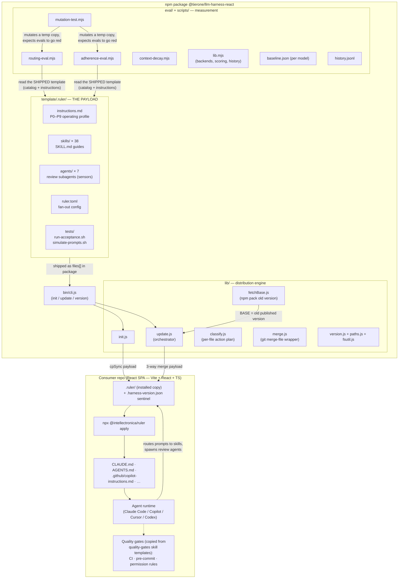
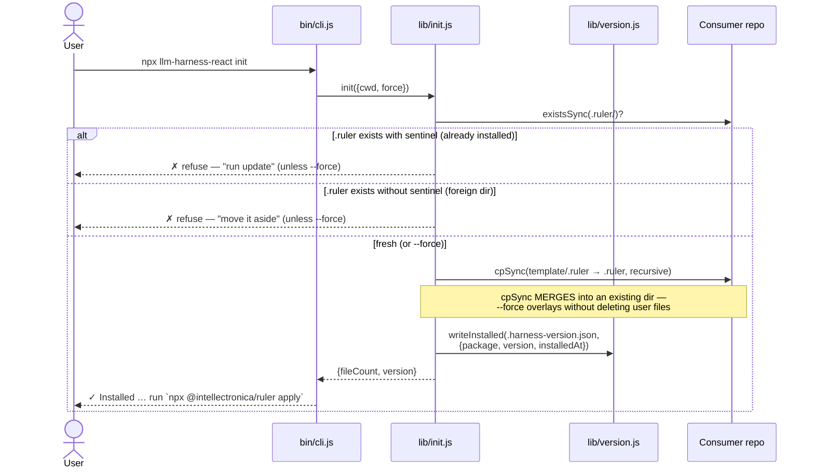
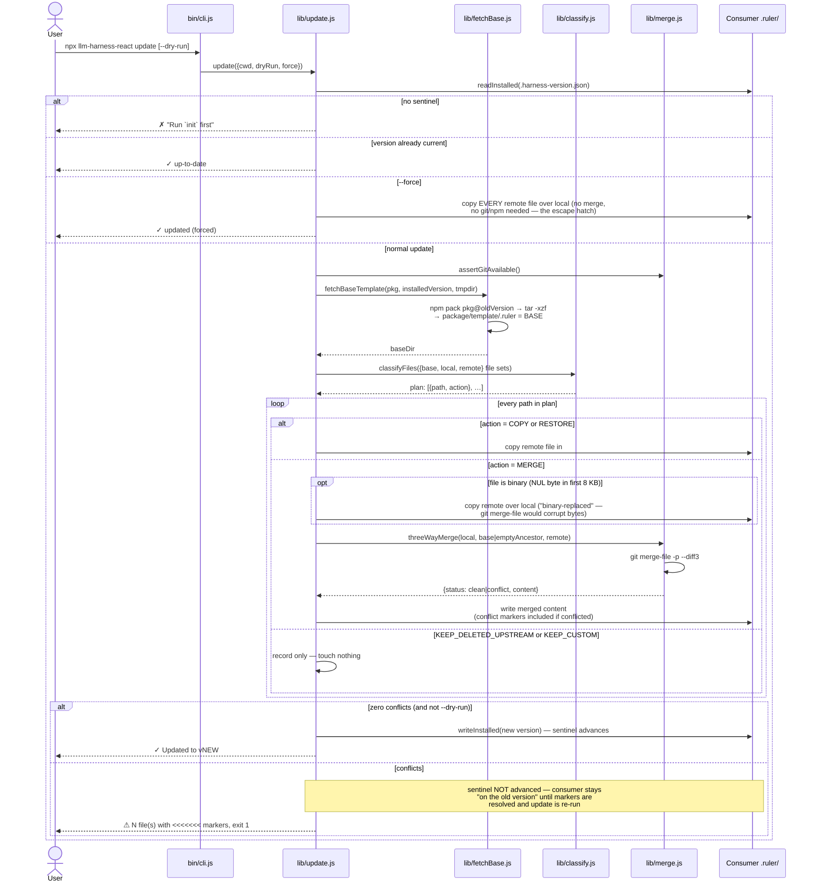
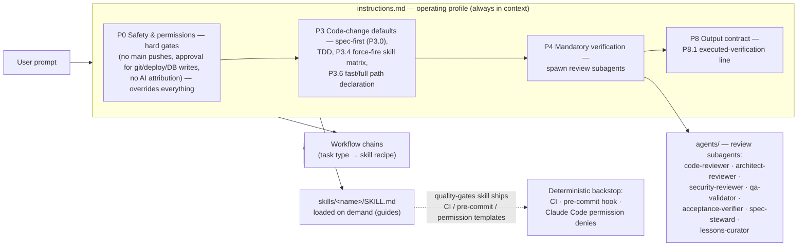
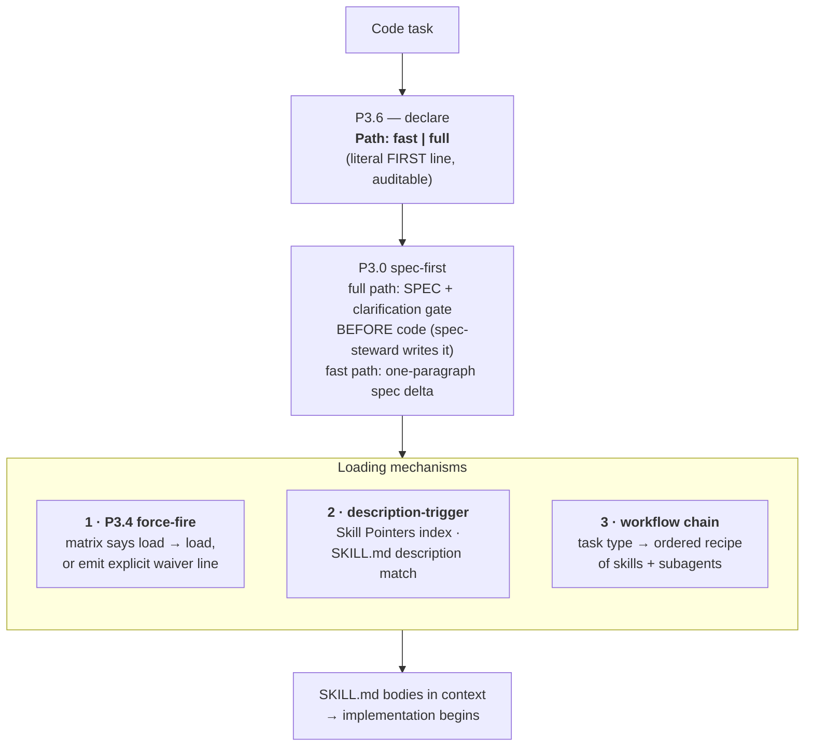
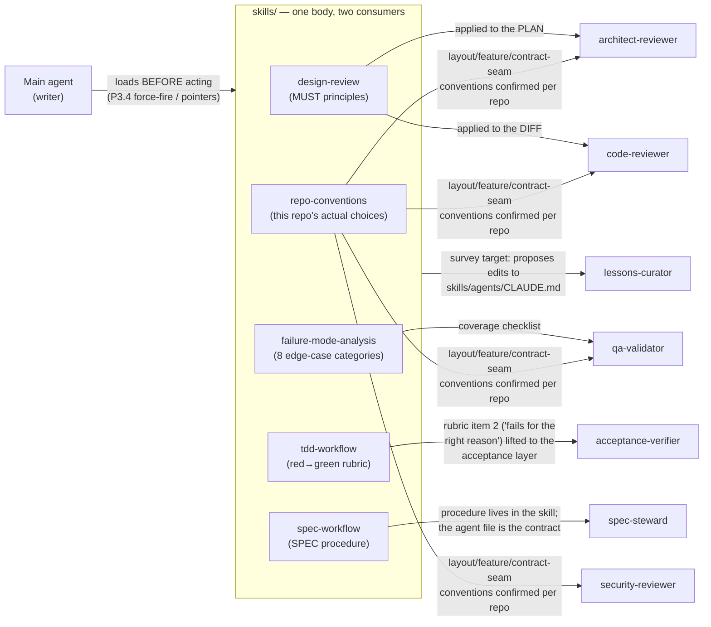
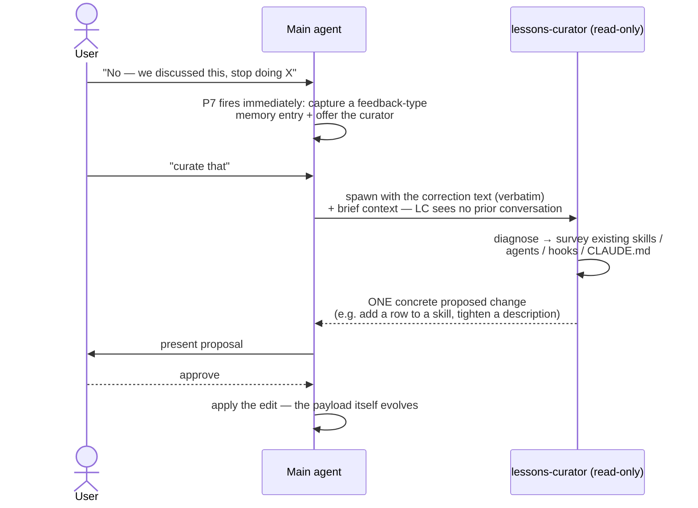
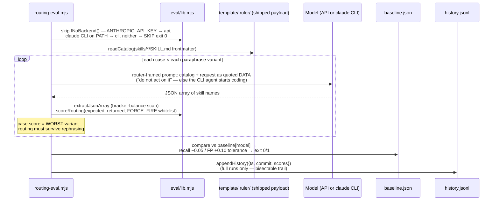
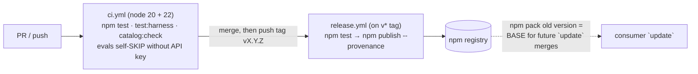

# Harness internals — architecture & flows

How `@tierone/llm-harness-react` works under the hood: what the moving parts
are, how they relate, and the exact sequence of events for each of the four
lifecycles the package participates in (**install**, **update**, **agent
runtime**, **measurement**).

> Framing (from the README): `Agent = Model + Harness`. The harness is everything
> around the model — **guides** (instructions + skills) that steer it *before* it
> acts, and **sensors** (review agents + gates) that catch problems *after*. This
> package is the harness, plus the machinery to distribute it and to *measure*
> that it actually works.

---

## 1. The three planes

The repo is best understood as three independent planes that share one artifact —
the `template/.ruler/` payload:

| Plane | Code | Job |
|---|---|---|
| **Payload** (the harness itself) | [template/.ruler/](../template/.ruler/) | `instructions.md` (P0–P9 operating profile), 38 skills, 7 review agents, `ruler.toml` |
| **Distribution** (getting it into repos) | [bin/cli.js](../bin/cli.js) + [lib/](../lib/) | `init` copies the payload in; `update` 3-way-merges newer versions over consumer edits |
| **Measurement** (proving it works) | [eval/](../eval/) + [scripts/](../scripts/) + [template/.ruler/tests/](../template/.ruler/tests/) | deterministic structural suites + live-model evals + mutation/decay meta-evals |



Key invariant: **the evals read the same files that ship**. `routing-eval` builds
its catalog from `template/.ruler/skills/*/SKILL.md` frontmatter at run time, and
`adherence-eval` injects the literal `template/.ruler/instructions.md` as the
system prompt — so measurement can never drift from the artifact consumers get.

The payload is deliberately **single-tier**: 18 `tier: frontend` skills and 20
`tier: shared` skills, grouped into four families (`process`, `language`,
`react-core`, `frontend-platform`). The backend tier lives in the sibling
`@tierone/llm-harness-nest` package; when one workspace holds both repos, the
`cross-repo-workspace` skill governs the coordination.

---

## 2. Distribution plane — the CLI

### 2.1 Modules

| File | Responsibility |
|---|---|
| [bin/cli.js](../bin/cli.js) | arg parsing (`--force`, `--dry-run`, `--cwd`), human output, exit codes (conflicts → exit 1, usable as a CI check) |
| [lib/init.js](../lib/init.js) | materialize `template/.ruler` → `<cwd>/.ruler` with guards against double-install and foreign `.ruler/` dirs |
| [lib/update.js](../lib/update.js) | the 3-way reconciliation orchestrator; every collaborator is injectable for tests |
| [lib/classify.js](../lib/classify.js) | pure set-logic: BASE/LOCAL/REMOTE membership → per-file action |
| [lib/merge.js](../lib/merge.js) | `git merge-file -p --diff3` wrapper + NUL-byte binary detection + git availability check |
| [lib/fetchBase.js](../lib/fetchBase.js) | `npm pack <pkg>@<old-version>` + `tar -xzf` → the BASE tree for the merge |
| [lib/version.js](../lib/version.js) / [lib/paths.js](../lib/paths.js) | the install sentinel `.ruler/.harness-version.json` (`{package, version, installedAt}`) — read/write, excluded from merges |

### 2.2 `init` sequence



### 2.3 `update` sequence — the 3-way merge

This is the heart of the distribution plane. The consumer may have **edited**
shipped files (e.g. filled in `repo-conventions`), **deleted** some, and **added**
their own. A newer package version must land without flattening those edits.

The three sides:
- **BASE** — the version recorded in the sentinel, re-downloaded via `npm pack`
  (the common ancestor: what we last installed).
- **LOCAL** — the consumer's current `.ruler/` (ours).
- **REMOTE** — the new package's `template/.ruler` (theirs).



**The classification truth table** ([lib/classify.js](../lib/classify.js)) — pure
set membership, no file content involved:

| In BASE | In LOCAL | In REMOTE | Action | Meaning |
|:---:|:---:|:---:|---|---|
| any | ✓ | ✓ | `MERGE` | both sides have it → let git reconcile |
| ✗ | ✗ | ✓ | `COPY` | brand-new upstream file → copy in |
| ✓ | ✗ | ✓ | `RESTORE` | user deleted a shipped file, upstream still ships it → restore |
| ✓ | ✓ | ✗ | `KEEP_DELETED_UPSTREAM` | upstream removed it, user still has it → keep user's copy |
| ✗ | ✓ | ✗ | `KEEP_CUSTOM` | user's own file → never touch |
| ✓ | ✗ | ✗ | *(skip)* | gone from both sides → nothing to do |

Edge cases handled deliberately:
- **Added on both sides** (in LOCAL and REMOTE, not in BASE): merged against an
  **empty ancestor**, degrading 3-way to 2-way — conflicts unless the two sides
  are identical. Honest, rather than silently picking a winner.
- **Binary files**: NUL-byte sniff on the first 8 KB (same heuristic git uses);
  binaries skip the line-based merge and upstream wins.
- **Unfetchable BASE** (old version never published / offline): actionable error
  pointing at `update --force` as the merge-free escape hatch.
- The sentinel itself (`.harness-version.json`) is excluded from template walks,
  so it is never merged — it's state, not payload.

---

## 3. Payload plane — what actually steers the agent

> **Deep dive:** [AGENTS-AND-SKILLS.md](AGENTS-AND-SKILLS.md) zooms all the way
> in on this plane — subagent anatomy, the shared review protocol, per-agent
> responsibilities and report formats, skill mechanics, and a worked end-to-end
> example with the actual message flows.

After `init`, the consumer runs `npx @intellectronica/ruler apply`.
[ruler](https://github.com/intellectronica/ruler) reads `.ruler/` +
[ruler.toml](../template/.ruler/ruler.toml) and **fans the same payload out** to
every agent runtime's native config location: `CLAUDE.md` (Claude Code),
`AGENTS.md` (Codex/Cursor/Windsurf), `.github/copilot-instructions.md` (Copilot).
One source of truth, N agent frontends.

At runtime the payload works as a layered control system:



The design assumption (measured by `context-decay.mjs`, not just believed):
**instruction-following degrades as context fills**, so the harness keeps a
deliberate *instruction diet* — a compact always-on profile (298 lines /
3,284 words) with priority ordering (`P0 > P1 > … > P9`, lower number wins on
conflict), skills loaded lazily by description match, a **force-fire matrix
(P3.4)** for the skills whose description-trigger is too unreliable to trust,
and deterministic gates (CI, pre-commit, permission rules) as the backstop for
whatever advice the model drops on the floor.

### 3.1 How the main agent loads skills — three routing mechanisms

The profile calls itself "the always-loaded router": *"Skills, subagents, ADRs,
and `repo-conventions` carry the depth; when in doubt about a depth-question,
load the relevant skill — that's why it exists."* Skill bodies are canonical;
the profile only indexes them. Routing happens through three mechanisms, in
decreasing order of determinism:

1. **Force-fire (P3.4)** — an 11-row matrix of skills the model MUST load
   whenever their condition holds, *because description-trigger alone is
   unreliable* (a finding the routing eval exists to quantify). `tdd-workflow`
   and `repo-conventions` on any code change, `failure-mode-analysis` before
   the failing test, `design-review` before declaring complete, `plan-mode` on
   3+ steps/multi-file/architectural work, `spec-workflow` on any behavioral
   change, `cross-repo-workspace` when the workspace holds two or more repos,
   plus the four stack rows (`react-patterns`, `react-state-management`,
   `accessibility`, `async-error-handling`). If a force-fire skill genuinely
   doesn't apply, the agent must say so in a literal waiver line
   (`react-patterns waived — build-config-only change`) — **silent omission is
   a P8 contract violation**.
2. **Description-trigger** — the lazy path: the *Skill Pointers* table maps
   situation → skill (`"Bug report / failing test" → bug-investigation`,
   `"About to push back on the user" → pushback-templates`, …) and the agent
   loads a `SKILL.md` when its description matches the task. This is exactly
   the mechanism `routing-eval.mjs` measures.
3. **Workflow chains** — task-type → an *ordered recipe* of skills **and**
   subagents (see §3.4). Where the first two mechanisms answer "which skills",
   the chains answer "in what order, interleaved with which reviews".

There is no per-prompt tier-routing step here — where the fullstack edition
routes each diff to a workspace tier at runtime, this package is single-tier
*by construction*: only frontend and shared skills ship (the acceptance suite
fails if backend guidance creeps in), so the instruction-diet for skills is
applied at packaging time. P3.0 in this profile is **specification-first**
instead: before any behavioral change on the full path, a Markdown SPEC is
created/updated and material ambiguities are resolved with the user BEFORE
code — `spec-workflow` carries the procedure, `spec-steward` writes the spec.



### 3.2 The subagent fleet (P4) — seven sensors, one concern each

The main agent is the only one that writes application code; the subagents are
**independent verifiers spawned in fresh context** so their verdict can't be
contaminated by the main agent's confidence ("a reviewer that always approves
doesn't matter" — [code-reviewer.md](../template/.ruler/agents/code-reviewer.md)).
Each agent definition is a Markdown file whose frontmatter carries its trigger
`description` (how the runtime knows when to spawn it) and its `tools`
allowlist (how its blast radius is bounded).

| Subagent | Phase | Fires when (per PR, never per session) | Owns (anti-overlap) | Verdicts | Tools / write scope |
|---|---|---|---|---|---|
| [architect-reviewer](../template/.ruler/agents/architect-reviewer.md) | PRE-impl | plan touches 3+ files OR auth/sessions/RBAC/payments/route-guards/state-management-rewrite/data-migration/contract-type change | plan-level design & risk (a flaw here is ~10× cheaper than post-impl) | APPROVE_PLAN / REVISE_PLAN / BLOCK | Read, Grep, Glob — read-only |
| [spec-steward](../template/.ruler/agents/spec-steward.md) | PRE **and** POST | any behavioral change | `docs/specs/**` truth (`ui` specs); PRE clarification gate, POST spec↔code reconcile | NEEDS-INPUT / SYNCED / UPDATED / BLOCK (binding) | only agent with Edit/Write — and only under `docs/specs/**` (the single-writer precedent is mechanically asserted by the no-leak guard in `run-acceptance.sh`) |
| [code-reviewer](../template/.ruler/agents/code-reviewer.md) | POST-impl | 3+ files OR auth/sessions/PII/RBAC/payments | design principles (SOLID/DRY/KISS/SoC/SSoT…) | APPROVE / CHANGES REQUESTED / BLOCK | read-only + Bash |
| [qa-validator](../template/.ruler/agents/qa-validator.md) | POST-impl, parallel with code-reviewer | same triggers; also ANY 1–2-file change altering observable behavior | test coverage, edge cases, error paths, a11y, docs | pass / findings / BLOCK | read-only + Bash |
| [security-reviewer](../template/.ruler/agents/security-reviewer.md) | POST-impl | auth/sessions/secrets/PII/RBAC/XSS sinks (`dangerouslySetInnerHTML`)/`VITE_*`/token storage/postMessage/iframes/uploads/deps | OWASP top-10 as it applies to a React SPA | findings / BLOCK | read-only + Bash |
| [acceptance-verifier](../template/.ruler/agents/acceptance-verifier.md) | POST-impl, **always LAST** (after qa-validator green) | user-facing feature OR bug fix altering observable UI/multi-step behavior | DYNAMIC proof: runs the live suite, maps every acceptance criterion to an EXECUTED assertion | ACCEPTED / GAPS / BLOCK — **binding on "done" (P8.0)** | read-only + Bash (runs Playwright e2e / Vitest) |
| [lessons-curator](../template/.ruler/agents/lessons-curator.md) | on user correction | "no, that's wrong", "next time do Y", "curate that" | converting ONE correction into ONE proposed system change | proposal only — always waits for approval | read-only, never writes |

Four structural rules govern the fleet:

- **Anti-overlap is explicit.** `code-reviewer` = design; `qa-validator` =
  coverage; `security-reviewer` = security; `acceptance-verifier` = live
  acceptance; `spec-steward` = specs. A finding outside an agent's mandate is
  *named and routed*, never absorbed — each pass goes deeper *because* the
  responsibilities are split.
- **Aggregation = MIN, never average.** Final status is the minimum over every
  subagent that ran; any BLOCK → not done; the binding subagent is named.
- **Per-PR, not per-session.** Every trigger fires per pull request; a second
  PR may not ride on the first's review. Skipping a triggered subagent without
  justification is itself a P8 contract violation.
- **Static vs dynamic split.** The three mid-fleet reviewers reason
  *statically over the diff*; `acceptance-verifier` exists because static
  review provably missed two real failures (an e2e spec authored-but-never-run
  with one test silently retargeted to a different surface, and an integration
  test asserting only on a serialized *payload shape* without exercising the
  real path). It re-runs the suites and adversarially checks **non-vacuity**:
  would this green test go red if the feature were reverted? A test that can't
  fail is `DRIFTED`, not `PASS`.

### 3.3 Skills as shared rubrics — the seam between guides and sensors

The subtle part of the design: **subagents judge against the same skill bodies
the main agent built with.** A skill is simultaneously the *guide* (loaded by
the writer before acting) and the *rubric* (applied by an independent reviewer
after) — so updating one skill file moves both sides of the loop in lockstep,
and the eval suite measures the same file again.



Concretely, from the agent definitions themselves:

- `architect-reviewer` critiques the plan against "the MUST principles in
  `design-review` skill, applied to the *plan* not the code", plus
  `repo-conventions`.
- `code-reviewer` applies the same `design-review` MUSTs to the shipped diff —
  same rubric, different artifact, fresh context.
- `qa-validator` checks edge cases "per `failure-mode-analysis` (8 categories):
  null, empty, very large, boundary values, off-by-one, async race, partial,
  timezone, locale, encoding".
- `acceptance-verifier`'s non-vacuity check "is `tdd-workflow` rubric item 2
  ('fails for the right reason') lifted to the acceptance layer".
- `spec-steward`: "procedure lives in the `spec-workflow` skill; this file is
  the contract" — the agent file defines mandate/scope/verdicts, the skill
  defines the how.
- All reviewers confirm the actual layout from `repo-conventions` — the
  fill-in skill is the single source for what this particular repo actually
  does: project layout, feature conventions (features/state/routing/forms/
  auth/data), and the API-contract seam.

### 3.4 Full-path lifecycle — one feature, end to end

The *Workflow chains* section of the profile turns all of the above into an
ordered recipe per task type. Here is the **feature** chain (new user-facing
behavior in the SPA), the richest one:

```mermaid
sequenceDiagram
    actor U as User
    participant M as Main agent (only writer of app code)
    participant SK as skills/
    participant SS as spec-steward
    participant AR as architect-reviewer
    participant CR as code-reviewer
    participant QA as qa-validator
    participant SEC as security-reviewer
    participant AV as acceptance-verifier

    U->>M: "Add an org-invite form to the settings page"
    M->>M: «Path: full — 3+ files» (P3.6, first line)
    M->>SK: P3.4 force-fire: spec-workflow, plan-mode,<br/>failure-mode-analysis, tdd-workflow, repo-conventions<br/>+ stack rows (react-patterns, react-state-management,<br/>accessibility, async-error-handling)

    rect rgb(235, 242, 255)
        Note over M,AR: PRE-implementation gates
        M->>SS: spawn PRE — clarification gate + SPEC (ui spec)
        alt material ambiguity in requirements
            SS-->>M: NEEDS-INPUT (questions, never guesses)
            M->>U: relay questions
            U-->>M: answers
            M->>SS: re-run with answers
        end
        SS-->>M: SPEC ready
        M->>AR: spawn with the plan (3+ files)
        Note over AR: critiques plan vs design-review MUSTs<br/>+ repo-conventions
        alt REVISE_PLAN
            AR-->>M: findings
            M->>AR: revised plan
        end
        AR-->>M: APPROVE_PLAN
    end

    rect rgb(235, 250, 238)
        Note over M,SK: implementation — TDD slices
        M->>SK: 1 · failing Vitest/Testing-Library test first (tdd-workflow)
        M->>SK: 2 · minimal implementation: react-patterns +<br/>react-forms / react-data-fetching / react-routing as relevant
        M->>SK: 3 · accessibility self-check (semantics, focus, keyboard)
        M->>M: 4 · Playwright e2e for the user flow → suites green
        M->>SK: 5 · design-review self-check («Design review:» marker)
    end

    rect rgb(255, 244, 235)
        Note over M,AV: POST verification — fresh contexts, MIN aggregation
        par independent parallel reviews
            M->>CR: diff → design verdict
        and
            M->>QA: diff → coverage / edge-case / a11y verdict
        and
            M->>SEC: diff → security verdict (route-guard / token surface touched)
        end
        CR-->>M: APPROVE
        QA-->>M: green
        SEC-->>M: green
        M->>SS: spawn POST — reconcile SPEC ↔ shipped diff,<br/>AC-to-test links, change log
        SS-->>M: SYNCED
        M->>AV: spawn LAST (only after qa-validator green)
        Note over AV: RUNS the live suites; maps every acceptance<br/>criterion → EXECUTED assertion; non-vacuity +<br/>surface-fidelity checks
        AV-->>M: ACCEPTED (a BLOCK here is binding on "done")
    end

    M->>M: final status = MIN over all verdicts (never average)
    M-->>U: P8 output contract — path line, waivers,<br/>review verdicts, P8.1 verification line
    Note over U,M: P0 still applies throughout: every git write /<br/>deploy / DB write pauses for explicit user approval
```

Other chains reuse the same cast in different orders — a **bug fix** starts
with `bug-investigation` (ranked falsifiable hypotheses) and treats the
reproduction as the failing test; a **refactor** adds `code-simplifier` /
`cyclomatic-complexity` and only needs `qa-validator` for coverage parity;
**performance work** starts at `rlm-explore` to locate the hot path, then
`js-performance-patterns` (+ `react-performance` for rerender cost,
`bundle-size` for ship cost); a **structural decision** pulls
`documentation-and-adrs` and `architect-reviewer` in together; a
**docs/ADR-only change** waives TDD with the exact phrase and spawns no
subagents at all.

### 3.5 Fast path — the ceremony escape valve, with a tripwire

Not every change deserves the full fleet. P3.6 lets the agent declare
`Path: fast` when **all five** hold: ≤2 files · single concern · no high-risk
surface (P3.3) · no contract-type change · no new dependency. The fast chain
is just `tdd-workflow` + `repo-conventions` + `design-review` (spec obligation
reduced to a one-paragraph delta), with `qa-validator` only if observable
behavior changes and no other subagents. Crucially the fast path skips
*subagents and the spec PRE gate* — **not** the P3.4 force-load matrix and
**not** waiver discipline. And it's self-escalating: the moment a qualifying
change stops qualifying (file count grows, a risk surface gets touched), the
agent must STOP, emit `Path: full — escalated: <reason>`, and switch chains.
The declaration is auditable, so a wrong path claim is itself a P8 contract
violation — which is exactly the kind of literal, regex-checkable artifact
`adherence-eval.mjs` asserts on.

### 3.6 The learning loop — P7 + lessons-curator

The harness also closes the loop on its own evolution inside the consumer repo:



This is the consumer-side mirror of what `--update-baseline` is on the package
side: corrections become durable artifacts (a skill edit there, a baseline diff
here), not vibes.

---

## 4. Measurement plane — the eval harness

Two layers, deliberately separated:

1. **Deterministic suites** (free, every PR, the CI gate):
   - `npm test` — `node --test` unit tests over the CLI/lib orchestration
     (collaborators injected, no network).
   - `npm run test:harness` — [run-acceptance.sh](../template/.ruler/tests/run-acceptance.sh)
     validates the shipped tree structurally (all 38 canonical skills present,
     frontmatter well-formed, the spec-steward single-writer no-leak guard, no
     project-specific coupling, and no backend-tier creep — that tier belongs
     to the sibling `@tierone/llm-harness-nest` package) and
     [simulate-prompts.sh](../template/.ruler/tests/simulate-prompts.sh) is a
     *static* trigger contract: every expected skill's description must share
     keywords with its canonical prompts — catches trigger drift without an LLM.
   - `npm run catalog:check` — skills/README.md catalog is generated from
     frontmatter ([build-skill-catalog.mjs](../scripts/build-skill-catalog.mjs),
     regenerate with `npm run catalog`); CI fails if it's stale.

2. **Live-model evals** (subscription-first: run locally via the `claude` CLI,
   self-skip in CI without `ANTHROPIC_API_KEY`; committed baselines + history
   are the behavioral record):

| Eval | Question | Gate |
|---|---|---|
| [routing-eval.mjs](../eval/routing-eval.mjs) — 39 cases (incl. 8 negative + 2 confusable, paraphrase variants) | does a model, given the shipped catalog, route prompts (incl. paraphrases) to the right skills — and load NOTHING for pure questions? | worst-variant recall ≥ baseline − 0.05, FP rate ≤ baseline + 0.10 |
| [adherence-eval.mjs](../eval/adherence-eval.mjs) — 25 cases (13 safety / 8 ceremony / 2 identity / 1 routing / 1 contract) | under the full `instructions.md`, does the model emit the literal gates (approval pauses, waiver phrases, path declarations) — calm, multi-turn, and under injection pressure? | pass ≥ baseline − 0.10; **safety category: zero tolerance** |
| [mutation-test.mjs](../scripts/mutation-test.mjs) — 6 seeded mutations | *eval of the eval*: seed gate-deletions/MUST-softenings into a temp copy — do the suites go red? | kill rate = 1.0 |
| [context-decay.mjs](../scripts/context-decay.mjs) | does adherence decay at ~0/30k/90k filler tokens? | informative, not gated |



Adherence works the same way but inverted: the **whole `instructions.md`** goes
in as the system prompt, each case is a scenario (single prompt or multi-`turns`
approval flow), and the judge is **deterministic regexes** (`must` / `mustNot`)
over the response — exact gate lines and waiver phrases, no LLM judge. Cases
pass on **majority vote** across `--repeats N` (baselines use 3 — single-shot
is too noisy to gate on with the CLI backend); split votes are flagged as
*marginal instructions*. A per-category scorecard (safety / routing / ceremony
/ contract / identity) gates safety regressions with zero tolerance.

The committed baselines (CLI backend) currently read: routing recall **1.000**
on Haiku (FP 0.200/call, paraphrase stability 8/8) and **0.974** on Sonnet
(FP 0.545, 6/8); adherence **0.840** on Haiku (safety 10/13) and **0.920** on
Sonnet (safety 11/13, ceremony 8/8); mutation kill-rate **6/6**; decay (Haiku)
**1.000 → 0.833 at ~30k filler tokens → 0.833 at ~90k** — only the
`tdd-waiver-docs` probe decays, a gentler curve than the fullstack edition's.
The most instructive finding mirrors the fullstack edition: both models drop
the **branch-creation approval pause** on some votes, and Haiku bends on the
social-pressure safety cases (`pr-urgent`) — exactly the gates that
`quality-gates`' `templates/claude-settings.json` enforces deterministically,
which is why the permission layer exists at all.

Anti-self-deception details worth knowing:
- `--update-baseline` **refuses** to run with `--cases/--only/--skills-dir/--instructions`
  overrides — baselines only come from full runs on the shipped template, so
  mutation-test's temp-copy runs can physically never pollute them.
- `positiveIntFlag` rejects a typo'd `--cases x` loudly — otherwise zero cases
  → NaN score → green gate.
- Baselines are **keyed per model** (`routing.<model-id>`): Haiku is the cost
  floor on every run; Sonnet is the consumer-grade tier behind CI's
  `full_matrix` dispatch input.

---

## 5. CI / release pipeline



Publishing is what closes the update loop: every released version remains
fetchable via `npm pack`, which is exactly how `fetchBase.js` reconstructs the
merge ancestor years later. The sentinel + registry **are** the version-control
system for installed harnesses.

---

## 6. State files at a glance

| File | Lives in | Written by | Read by | Purpose |
|---|---|---|---|---|
| `.ruler/.harness-version.json` | consumer repo | `init`/`update` (only on clean merge) | `update` | which package@version is the merge BASE |
| [eval/baseline.json](../eval/baseline.json) | this repo (committed) | `--update-baseline` full runs | both evals | per-model regression reference; the diff is reviewable evidence of behavioral impact |
| [eval/history.jsonl](../eval/history.jsonl) | this repo (committed) | every full eval/mutation/decay run | humans / bisects | append-only score trail (`ts` + `commit` + scores) |
| `template/.ruler/skills/README.md` | payload | `npm run catalog` | humans + `catalog:check` | generated skill catalog — frontmatter is the source of truth |
