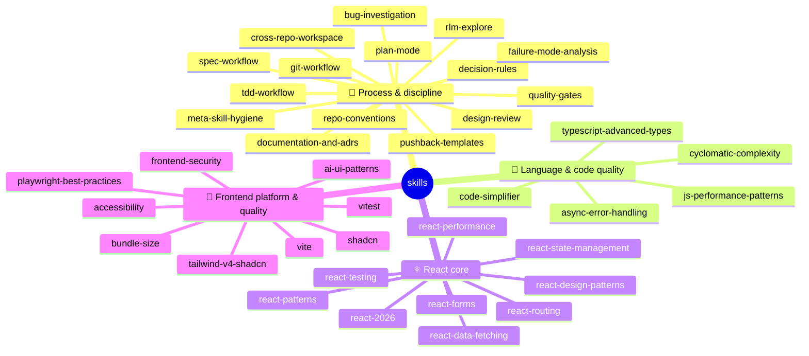

# Skill Catalog

<!-- GENERATED FILE — do not edit by hand. Source of truth: each skill's frontmatter
     (harness: tier/family/gist). Regenerate: npm run catalog. CI fails if stale. -->

38 skills in 4 families. The directories are **flat by requirement** — agent runtimes
(Claude Code, Codex, Cursor) discover skills as `skills/<name>/SKILL.md`, so grouping
lives here, not in the filesystem. Depth lives in each skill's `topics/` / `patterns/` /
`rules/` files, read on demand. Routing rules (what loads when) are in
`instructions.md` § Skill Pointers; this page is the human-facing map.

## 🧭 Process & discipline (15)

| Skill | What it gives you |
|---|---|
| [bug-investigation](./bug-investigation/SKILL.md) | Ranked falsifiable hypotheses before any fix |
| [cross-repo-workspace](./cross-repo-workspace/SKILL.md) | Lens-switching when one session spans two or more repos |
| [decision-rules](./decision-rules/SKILL.md) | Defaults under ambiguity; the canonical skill-vs-repo conflict table |
| [design-review](./design-review/SKILL.md) | SOLID/DRY/KISS pass + the verification line, before declaring done |
| [documentation-and-adrs](./documentation-and-adrs/SKILL.md) | ADR format + the layered-router documentation principle |
| [failure-mode-analysis](./failure-mode-analysis/SKILL.md) | Edge cases enumerated BEFORE the failing test |
| [git-workflow](./git-workflow/SKILL.md) | Branch/commit/PR mutations done safely |
| [meta-skill-hygiene](./meta-skill-hygiene/SKILL.md) | Auditing this skill library itself (overlap, bloat, size ceilings) |
| [plan-mode](./plan-mode/SKILL.md) | Plans for 3+ step / multi-file / architectural work |
| [pushback-templates](./pushback-templates/SKILL.md) | How to disagree: observation, tradeoff, question — one round |
| [quality-gates](./quality-gates/SKILL.md) | CI, pre-commit & permission-gate templates (deterministic enforcement) |
| [repo-conventions](./repo-conventions/SKILL.md) | YOUR repo's binding facts (fill-in skeleton, both tiers + seam) |
| [rlm-explore](./rlm-explore/SKILL.md) | Slice-based digestion of big or unfamiliar context |
| [spec-workflow](./spec-workflow/SKILL.md) | SPEC before code on behavioral changes; reconcile after |
| [tdd-workflow](./tdd-workflow/SKILL.md) | Failing test first, the waiver phrases, the test-quality rubric |

## 🔡 Language & code quality (5)

| Skill | What it gives you |
|---|---|
| [async-error-handling](./async-error-handling/SKILL.md) | Promise composition, AbortSignal, where to catch |
| [code-simplifier](./code-simplifier/SKILL.md) | Surgical cleanup of recently-modified code, behavior preserved |
| [cyclomatic-complexity](./cyclomatic-complexity/SKILL.md) | Flattening branch-heavy, nested functions |
| [js-performance-patterns](./js-performance-patterns/SKILL.md) | Hot-path runtime performance — 12 patterns (index + topics) |
| [typescript-advanced-types](./typescript-advanced-types/SKILL.md) | Generics, conditional/mapped/template-literal types (index + topics) |

## ⚛️ React core (9)

| Skill | What it gives you |
|---|---|
| [react-2026](./react-2026/SKILL.md) | The modern stack tour + composition idioms (index + topics) |
| [react-data-fetching](./react-data-fetching/SKILL.md) | Server data: caching, invalidation, optimistic updates — 11 patterns (index + topics) |
| [react-design-patterns](./react-design-patterns/SKILL.md) | Nine classic patterns — hooks, HOC, render props, provider, compound, presentational/container, module, mixin, proxy (index + patterns) |
| [react-forms](./react-forms/SKILL.md) | RHF + Zod, schema-first, accessible field errors |
| [react-patterns](./react-patterns/SKILL.md) | Components, hooks, lifting state, refs, lists |
| [react-performance](./react-performance/SKILL.md) | Measurement discipline + the 25-pattern deep render-mechanics catalog (index + topics) |
| [react-routing](./react-routing/SKILL.md) | Routes, guards, expired-session flow, code-split per route |
| [react-state-management](./react-state-management/SKILL.md) | WHERE state lives — the four-layer model; server data never in `useState` |
| [react-testing](./react-testing/SKILL.md) | Vitest + Testing Library + Playwright layer choice |

## 🎨 Frontend platform & quality (9)

| Skill | What it gives you |
|---|---|
| [accessibility](./accessibility/SKILL.md) | Semantic HTML, ARIA, focus & keyboard rules for UI changes |
| [ai-ui-patterns](./ai-ui-patterns/SKILL.md) | Streaming/chat AI interface patterns |
| [bundle-size](./bundle-size/SKILL.md) | Bundle audits, tree-shaking, lazy routes, dependency cost |
| [frontend-security](./frontend-security/SKILL.md) | XSS sinks, `VITE_*` leakage, token storage |
| [playwright-best-practices](./playwright-best-practices/SKILL.md) | E2E patterns by framework & surface (index + topic dirs) |
| [shadcn](./shadcn/SKILL.md) | Day-to-day shadcn component work |
| [tailwind-v4-shadcn](./tailwind-v4-shadcn/SKILL.md) | Tailwind v4 + shadcn setup, theming, dark mode (index + topics) |
| [vite](./vite/SKILL.md) | Vite config & build optimization |
| [vitest](./vitest/SKILL.md) | Vitest config and test API |

---

Adding a skill? Keep the directory flat, set `harness: tier/family/gist` in its
frontmatter, and run `npm run catalog` (the acceptance suite and `catalog:check` fail
if this file is stale). Respect the size ceiling (`meta-skill-hygiene` § Bloat: warn
>400 lines, fail >800 — split into index + topics).
